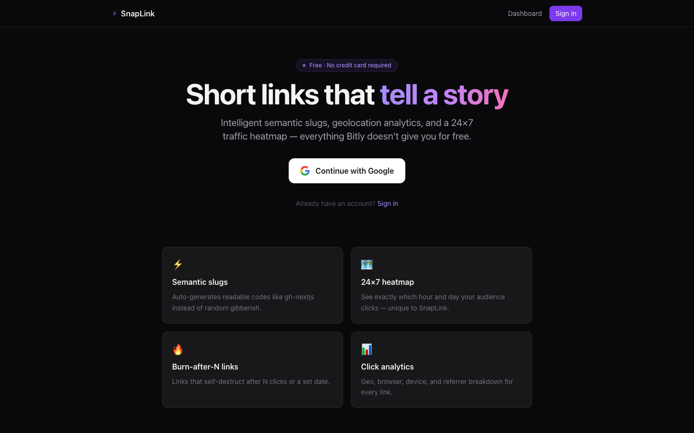
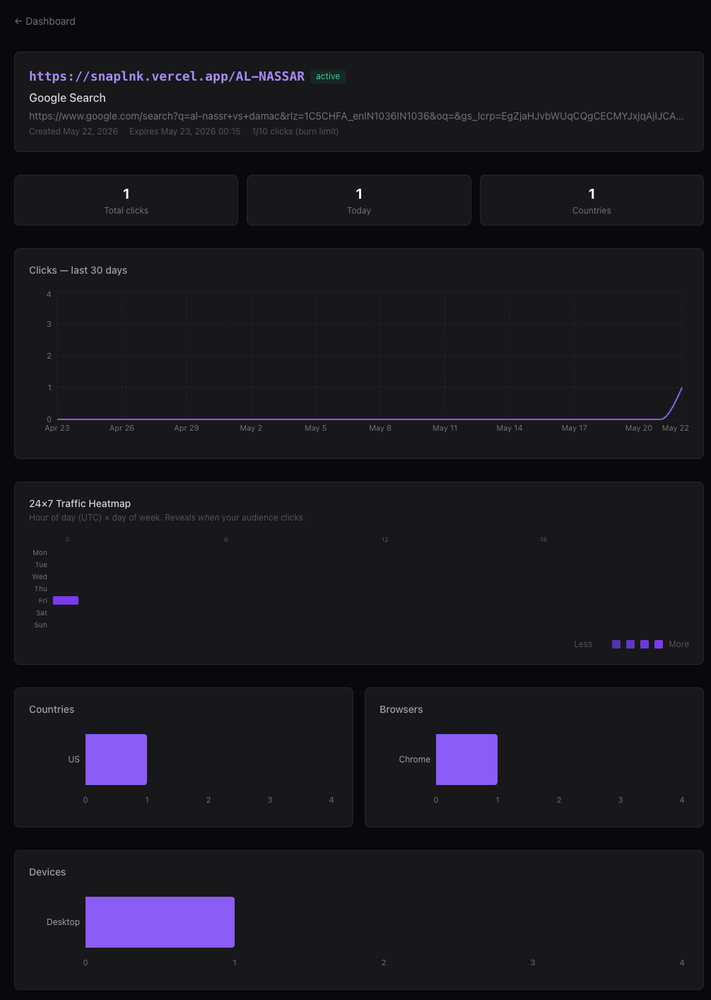

# SnapLink — URL Shortener with Analytics

A production-ready URL shortener with intelligent slug generation, click analytics, and a 24×7 traffic heatmap.

**Live demo → [snaplnk.vercel.app](https://snaplnk.vercel.app)**

---

## Screenshots




## Features

- **Semantic slugs** — auto-generates readable codes like `gh-nextjs` from URL content instead of random characters
- **OG metadata enrichment** — fetches title, description, and preview image for every link
- **24×7 click heatmap** — shows which hour and day of the week gets the most traffic
- **Burn-after-N links** — links that self-destruct after N clicks or a set date
- **Google OAuth** — per-user dashboards, each user sees only their own links
- **Redis caching** — redirects hit cache first (<1ms), zero DB load on repeat visits
- **Sliding window rate limiting** — 10 shortens/min per IP via Redis sorted sets
- **Click analytics** — geo, browser, OS, device, and referrer tracked on every click
- **Async click tracking** — click is tracked after the redirect is already sent, no latency impact

---

## Tech Stack

| Layer | Technology |
|---|---|
| Framework | Next.js 16 (App Router, TypeScript) |
| Database | PostgreSQL via Prisma ORM |
| Cache / Rate limiting | Redis (ioredis) |
| Auth | Auth.js v5 (Google OAuth) |
| Charts | Recharts |
| Styling | Tailwind CSS |
| Deployment | Vercel (app) + Railway (Postgres + Redis) |

---

## Local Setup

### Prerequisites
- Node.js 18+
- Docker Desktop

### Steps

```bash
# 1. Clone the repo
git clone https://github.com/vrajdesai17/snaplink.git
cd url-shortener

# 2. Install dependencies
npm install

# 3. Start Postgres and Redis
docker-compose up -d

# 4. Copy env file
cp .env.example .env.local

# 5. Push database schema
npm run db:push

# 6. Start dev server
npm run dev
```

Open [http://localhost:3000](http://localhost:3000).

### Environment Variables

| Variable | Description |
|---|---|
| `DATABASE_URL` | PostgreSQL connection string |
| `REDIS_URL` | Redis connection string |
| `NEXT_PUBLIC_APP_URL` | Your app's public URL |
| `AUTH_SECRET` | Random 32-byte secret for Auth.js sessions |
| `AUTH_GOOGLE_ID` | Google OAuth client ID |
| `AUTH_GOOGLE_SECRET` | Google OAuth client secret |

---

## Deployment

### 1. Provision infrastructure (Railway)
- Create a Railway project
- Add **PostgreSQL** and **Redis** services
- Copy the public connection strings for both

### 2. Deploy app (Vercel)
```bash
vercel deploy --prod
```

### 3. Set environment variables in Vercel
Add all 6 variables from the table above via the Vercel dashboard or CLI.

### 4. Push schema to production database
```bash
DATABASE_URL="your-railway-postgres-url" npx prisma db push
```

### 5. Configure Google OAuth
In [Google Cloud Console](https://console.cloud.google.com):
- Go to APIs & Services → Credentials → your OAuth client
- Add `https://your-domain.vercel.app/api/auth/callback/google` to Authorized redirect URIs

---

## Architecture

```
Browser → GET /[code]
           │
      Redis cache hit?
      ├─ Yes → redirect immediately (<1ms)
      └─ No  → Prisma DB lookup → cache result → redirect
                    │
              trackClick() ← fire-and-forget (async)
                    │
              INSERT click row + UPDATE click_count
```

### Key design decisions

- **Write-through cache** — new links are cached on creation, not just on first read
- **Semantic slugs** — extracted from domain + path keywords, falls back to base62 on collision
- **Async tracking** — `trackClick()` runs after `NextResponse.redirect()` is returned so the user never waits
- **Graceful Redis fallback** — if Redis is down, the app still works using DB lookups only

---

## Database Schema

```
users        — OAuth user accounts
urls         — shortened links (userId, shortCode, ogTitle, maxClicks, expiresAt)
clicks       — one row per click (country, browser, device, hourOfDay, dayOfWeek)
accounts     — Auth.js OAuth account links
sessions     — Auth.js session tokens
```

---

## Scripts

```bash
npm run dev          # start development server
npm run build        # production build
npm run db:push      # sync Prisma schema to database
npm run db:studio    # open Prisma Studio (visual DB browser)
```
